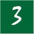

<!DOCTYPE html>
<html lang="en">
<head>
  <title></title>
  <meta charset="utf-8">
  <meta name="viewport" content="width=device-width, initial-scale=1.0">
  <link rel="stylesheet" href="https://maxcdn.bootstrapcdn.com/bootstrap/3.3.7/css/bootstrap.min.css">
  
  
  <link rel="stylesheet" type="text/css" href="aure.css">
  
</head>
<body>
  

    <nav class="navbar navbar-inverse">
      

        

          <button type="button" class="navbar-toggle" data-toggle="collapse" data-target="#myNavbar">
            
            
            
          </button>
          <a class="navbar-brand" href="#" style="color:green;">NUNATU</a>
        

        

          <ul class="nav navbar-nav">
            <li class="active"><a href="">Home</a></li>
            <li><a href="#">Mission</a></li>
            <li><a href="#">Vision</a></li>
            <li><a href="#">Notre Equipe</a></li>
            <li><a href="mailto:info@nunatu.org">&#9993 info@nunatu.org</a></li>
          </ul>
        

      

    </nav>
  

  

    

      <picture>
      <source media="(max-width:799px)" srcset="handsclose.jpeg">
      <source media="(min-width:800px)" srcset="hands.jpeg">
        
      </picture>
      
      

      Nous sommes une <strong style="color:green;">initiative priv&eacute;e</strong> impuls&eacute;e par la compassion
      pour les personnes vivant au quotidien une <strong style="color:green;">pr&eacute;carit&eacute;</strong> qui ne
      leur permet pas de r&eacute;pondre &aacute; leurs <strong style="color:green;">besoins humains</strong> les plus
      &eacute;l&eacute;mentaires (physiques, &eacute;conomiques, civils)...

    

    

      

        <h2 style="text-align:center;">Notre Vision</h2>
        
Notre vision est de permettre aux enfants, aux jeune et aux femmes d'&ecirc;tre
        des membres valorisés de leur communauté, leur donner les moyens de s'y &eacute;panouir et d'&ecirc;tre des
        acteurs actifs de d&eacute;veloppement par les renforcements de capacit&eacute;, l'entrepreneuriat et les
        initiatives sociales.

      

    

    

      

        <h2 style="text-align:center;margin-top:30px;padding-top:20px;">Notre Mission</h2>
        
        
Stimuler le d&eacute;veloppement personnel et la
        r&eacute;lisation de soi. 

        
        
Accompagner chaque personne vuln&eacute;rable &aacute; (re)d&eacute;couvrir son potentiel et sa dignit&eacute;. 

        
        
Transformer chaque individu en personne ressource et en acteur de développement de sa soci&eacute;t&eacute;. 

         
         
      

    

  

  

    

	     

         

           

           <iframe src="https://www.google.com/maps/embed?pb=!1m18!1m12!1m3!1d2520.6706787534026!2d4.407767515661505!3d50.81873997952778!2m3!1f0!2f0!3f0!3m2!1i1024!2i768!4f13.1!3m3!1m2!1s0x47c3db33e3fe068d%3A0x640f11f8e5b0172b!2sBoulevard+des+Invalides+183%2C+1160+Auderghem!5e0!3m2!1sfr!2sbe!4v1537985267018" width="100%" height="auto" frameborder="0" style="border:0" allowfullscreen></iframe>
    	    

        

      	

    		<h2>Nunatu Asbl</h2>
    		<address>
    			<strong>Nunatu, la compassion en action</strong> 
    			Boulevard des invalides 183/12 
    			1160 Bruxelles 
    			Belgique 
    			&#9742 +32489 93 95 66 
    		</address>
    	

    

  

</body>
</html>
